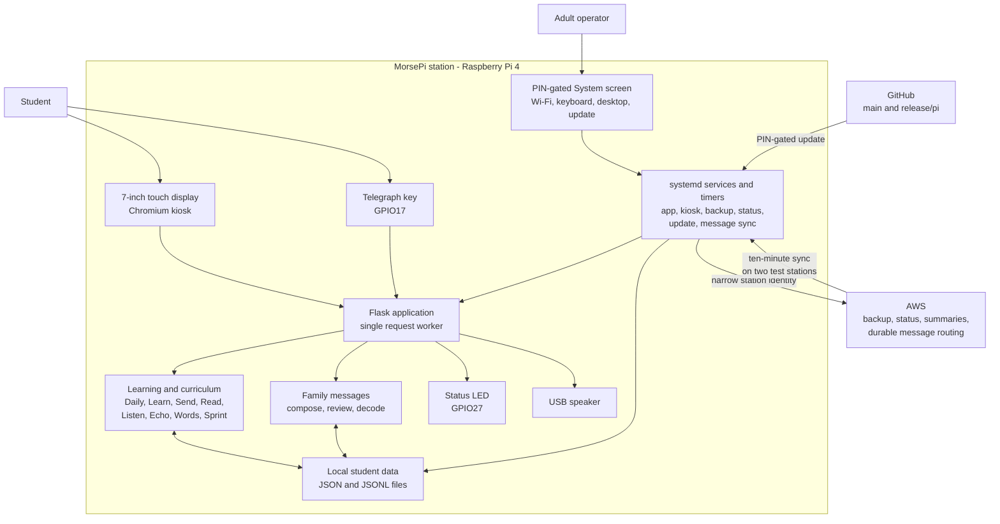
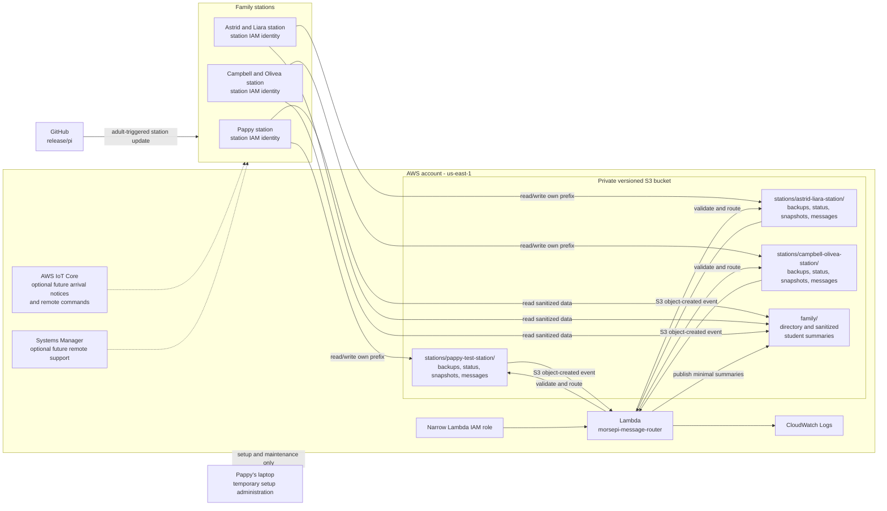

# MorsePi Architecture

This document shows the current project and AWS architecture. Solid lines are
implemented paths. Dashed lines are disabled or future options.

## Project Architecture

There are three stations using the same application and release:

| Station ID | Local students | Special role |
|---|---|---|
| `pappy-test-station` | Pappy and all four grandkids | Family practice and test station |
| `astrid-liara-station` | Astrid and Liara | Grandkid home station |
| `campbell-olivea-station` | Campbell and Olivea | Grandkid home station |

Student progress belongs to the student, not the physical station. Each Pi has
its own configuration, local roster, admin PIN, data directory, and narrow AWS
credential. Guest is disposable and cannot send or receive family messages.

## AWS Architecture

## Security Boundaries

- Each station can access only its own S3 prefix plus sanitized `family/` data.
- Stations cannot read another station's raw backups or create AWS resources.
- S3 invokes Lambda using a bucket- and account-scoped permission.
- Lambda independently validates station, sender, receiver, message limits,
  learned letters, and object paths before routing.
- The bucket blocks public access, uses encryption, and retains versions.
- Broad AWS administration is temporary and should be disabled after setup.
- Cross-station message sync is enabled on Pappy and Astrid/Liara for testing;
  Campbell/Olivea remains disabled until deliberately added.

## Data Flows

### Backup And Status

1. A station creates a local backup and a small operational status record.
2. Its station credential uploads them only to its assigned S3 prefix.
3. Pappy can review or restore the records using an adult AWS identity.

### Cross-Station Message

1. A sender builds and reviews a message using learned words and the keyer.
2. The station stores it locally, then uploads an immutable outbox record.
3. S3 invokes Lambda. Lambda validates the record and writes recipient inbox
   copies only to approved stations.
4. A receiver station downloads one idempotent copy when it is online.
5. Opening or decoding creates a receipt that Lambda routes back to the sender.

Related details:

- [Cloud messaging design](CLOUD_MESSAGING_DESIGN.md)
- [AWS backup and sync design](AWS_BACKUP_SYNC_DESIGN.md)
- [AWS setup reference](AWS_SETUP_REFERENCE.md)
- [Remote backup, status, and update runbook](REMOTE_BACKUP_STATUS_RUNBOOK.md)
- [Security and family data](../SECURITY.md)
