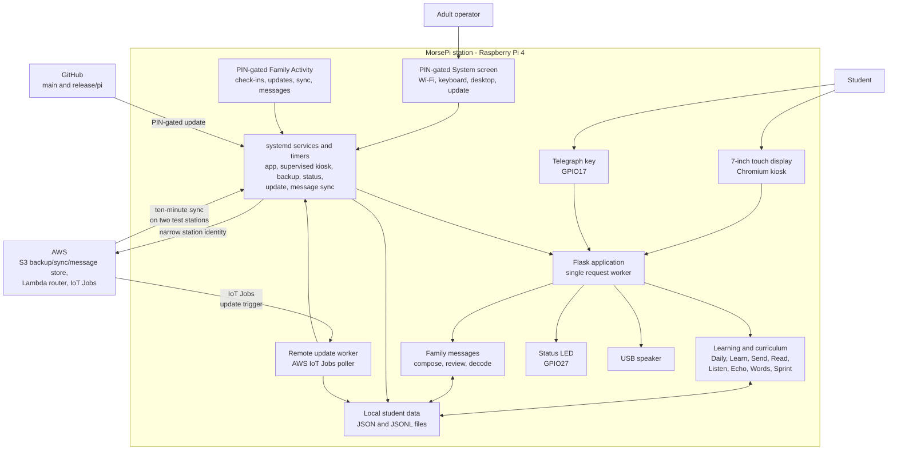
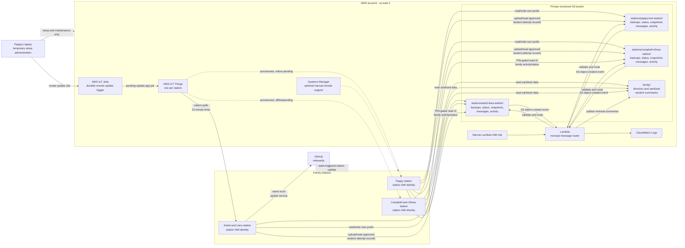

# MorsePi Architecture

This document shows the current project and AWS architecture as of the
September 2026 family-activity release. Solid lines are implemented paths.
Dashed lines are disabled, partial, or optional support paths.

## Project Architecture

There are three stations using the same application and release:

| Station ID | Local students | Special role |
|---|---|---|
| `pappy-test-station` | Pappy and all four grandkids | Family practice and test station |
| `astrid-liara-station` | Astrid and Liara | Grandkid home station |
| `campbell-olivea-station` | Campbell and Olivea | Grandkid home station |

Student progress belongs to the student, not the physical station. Each Pi has
its own configuration, local roster, admin PIN, data directory, and narrow AWS
credential. Guest is disposable and cannot send or receive family messages.

## AWS Architecture

## Security Boundaries

- Each station can access its own station S3 prefix, sanitized `family/` data,
  and only the approved student-attempt prefixes needed for its roster.
- Activity permissions are narrower: each station writes only its own activity
  prefix, and Pappy alone reads the three activity/status prefixes.
- Stations cannot read another station's raw backups or create AWS resources.
- S3 invokes Lambda using a bucket- and account-scoped permission.
- Lambda independently validates station, sender, receiver, message limits,
  learned letters, and object paths before routing.
- AWS IoT Jobs uses one Thing per station and a narrow data-plane policy; a
  station can read/update only its own Job executions.
- Remote Jobs are declarative actions such as `update-app`; the Pi worker
  rejects unknown actions and never executes shell text from AWS.
- The bucket blocks public access, uses encryption, and retains versions.
- Broad AWS administration is temporary and should be disabled after setup.
- Cross-station message sync is enabled on Pappy and Astrid/Liara for testing;
  Campbell/Olivea remains disabled until deliberately added.
- Systems Manager remains optional remote-hands support, not the normal update
  path, because of fixed per-device monthly cost.

## Data Flows

### Backup And Status

1. A station creates a local backup and a small operational status record.
2. Its station credential uploads them only to its assigned S3 prefix.
3. Pappy can review or restore the records using an adult AWS identity.

### Cross-Station Message

1. A sender builds and reviews a message using learned words and the keyer.
2. The station stores it locally, then uploads an immutable outbox record.
3. S3 invokes Lambda. Lambda validates the record and writes recipient inbox
   copies only to approved stations.
4. A receiver station downloads one idempotent copy when it is online.
5. Opening or decoding creates a receipt that Lambda routes back to the sender.

### Student Progress Sync

1. Practice, Words, and Sprint attempts are stored as immutable local records
   with stable attempt IDs and canonical student UUIDs.
2. The guarded sync worker uploads local attempts, downloads approved attempts
   for local rostered students, quarantines conflicts, and rebuilds derived
   progress locally.
3. Sync runs on adult demand, after safe shutdown, and by guarded timer when
   the station has been idle long enough.

### Remote Update

1. Pappy promotes tested code to GitHub `release/pi`.
2. Pappy creates an AWS IoT Job containing an allowed action such as
   `update-app`.
3. A station polls IoT Jobs while online. Pappy and Astrid/Liara currently
   have this timer enabled; Astrid/Liara has completed a live `update-app` Job
   successfully, and Pappy has completed a local update-service smoke test
   after conversion to a Git checkout.
4. The station worker starts the existing local update service, which backs up,
   fast-forwards, tests, restarts, health-checks, and reports status.
5. The worker records local status and marks the AWS Job `SUCCEEDED` or
   `FAILED`.

### Family Activity

1. Progress, message, and update workers create privacy-limited events only
   after reaching their confirmed checkpoint.
2. Offline events remain in the station's pending queue and retry without
   duplication during later cloud work.
3. The normal 30-minute sync uploads a fresh station status; message events
   also follow the shorter message-sync schedule.
4. Pappy refreshes and caches all three activity/status prefixes. A station
   outage preserves its last known cache and is shown as a warning.
5. The adult opens the PIN-gated Family Activity screen. No message text,
   student display name, detailed score, or raw key timing enters this feed.

Current remote-update rollout:

| Station | AWS IoT Thing | Remote-update timer | Status |
|---|---|---|---|
| `pappy-test-station` | Created | Enabled | Converted to Git checkout on `release/pi`; local update timer and IoT Jobs poller enabled. Station credential can poll/consume Jobs but cannot create Jobs. |
| `astrid-liara-station` | Created | Enabled | Live `update-app` Job succeeded |
| `campbell-olivea-station` | Created | Pending | Station offline/pending reconnection |

Related details:

- [Cloud messaging design](CLOUD_MESSAGING_DESIGN.md)
- [AWS backup and sync design](AWS_BACKUP_SYNC_DESIGN.md)
- [AWS setup reference](AWS_SETUP_REFERENCE.md)
- [Family activity](FAMILY_ACTIVITY.md)
- [Remote backup, status, and update runbook](REMOTE_BACKUP_STATUS_RUNBOOK.md)
- [Security and family data](../SECURITY.md)
