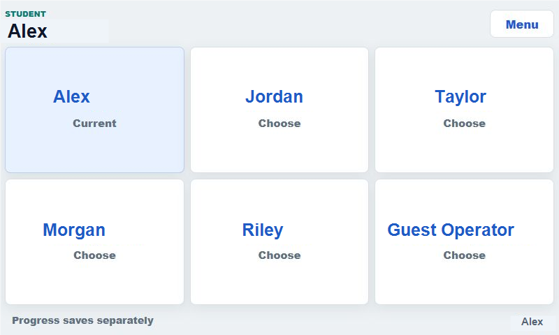
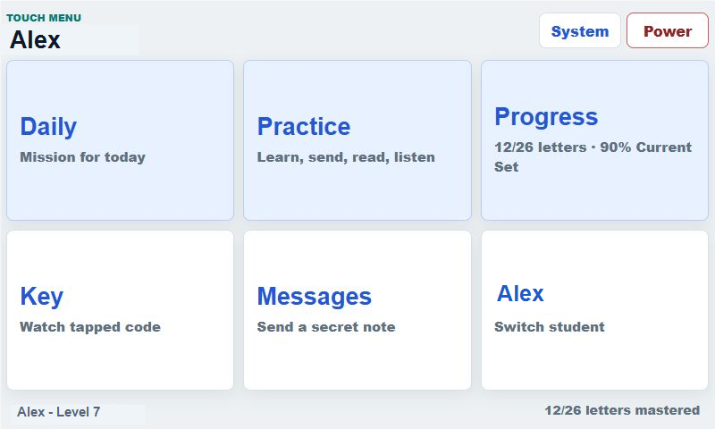
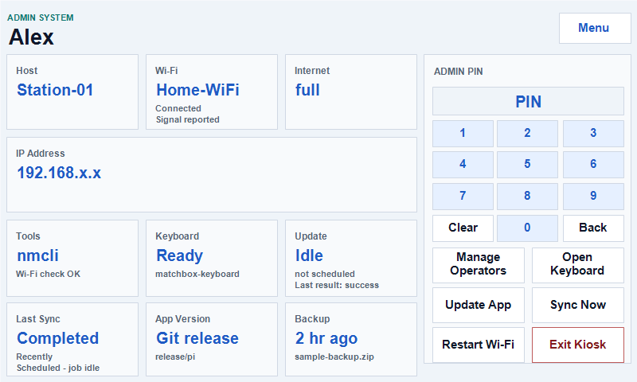

# Home Wi-Fi Setup Checklist

Use this checklist when a MorsePi station arrives at a new house and needs to
join the home Wi-Fi. This is an adult setup task because it may require the
Admin PIN and access to the Raspberry Pi desktop.

The station still works offline for practice. Backup, family sync, messages,
and remote updates start working after the station is online.

Screenshots in this guide use sample operator names and sample network values.

## Before You Start

- Plug in the MorsePi station and wait for the touch app to open.
- Have the home Wi-Fi name and password ready.
- Have the station Admin PIN ready.
- If typing is needed, use the on-screen keyboard from the Admin System screen.

## 1. Start At The Operator Screen

After boot, the station should open to the operator picker if more than one
student is available. Names may be different on each station.

If the station opens directly to a student's Daily screen, tap the student name
or `Menu` until you can reach the main touch menu.

## 2. Open The Touch Menu

Tap `Menu` to reach the touch menu. This is the main adult navigation screen.

Tap `System` to open the Admin System screen.

## 3. Check The Admin System Screen

The Admin System screen shows whether the station is connected and ready to
sync. The screenshot below uses example network values.

Look for:

- `Wi-Fi`: should show the home network name after setup.
- `Internet`: should show a good connection.
- `IP Address`: should show a local address, usually starting with `192.168`,
  `10.`, or `172.`.
- `Keyboard`: should show `Ready` if the on-screen keyboard is installed.
- `Last Sync`: should update after the station has been online for a while.
- `Backup`: should update after the station uploads a backup.

## 4. If Wi-Fi Is Not Connected

1. Enter the Admin PIN using the on-screen keypad.
2. Tap `Open Keyboard` if the Wi-Fi password needs to be typed.
3. Tap `Exit Kiosk` to reach the Raspberry Pi desktop.
4. Use the desktop Wi-Fi icon to select the home Wi-Fi network.
5. Enter the Wi-Fi password.
6. Return to the MorsePi app or restart the station.

If the Wi-Fi menu seems stuck, return to Admin System, enter the Admin PIN, tap
`Restart Wi-Fi`, wait about 30 seconds, and try again.

## 5. Confirm The Station Is Online

Return to Admin System and confirm:

- `Wi-Fi` shows the home network.
- `Internet` shows a working connection.
- `IP Address` has a local network address.
- `Last Sync` is no longer `unknown` after the station has had time to run.

Sync is not instant. A station may need 10 to 30 minutes online before all
backup and progress status catches up.

## 6. If Something Still Looks Wrong

- Kids can keep practicing offline; progress should sync later.
- Take a clear photo of the Admin System screen and send it to Pappy.
- If the screen is stuck, use the safe shutdown option if available, wait for
  the screen to go dark, then use the Pi power switch to turn it off and back on.
- If the on-screen keyboard does not open, connect a USB keyboard temporarily.

## Quick Success Check

- [ ] MorsePi boots into the touch app.
- [ ] Operator picker or Daily screen appears.
- [ ] Admin System opens.
- [ ] Wi-Fi shows the home network.
- [ ] Internet shows connected.
- [ ] IP Address is present.
- [ ] Last Sync updates after the station has been online.
- [ ] A practice attempt still works after Wi-Fi setup.
